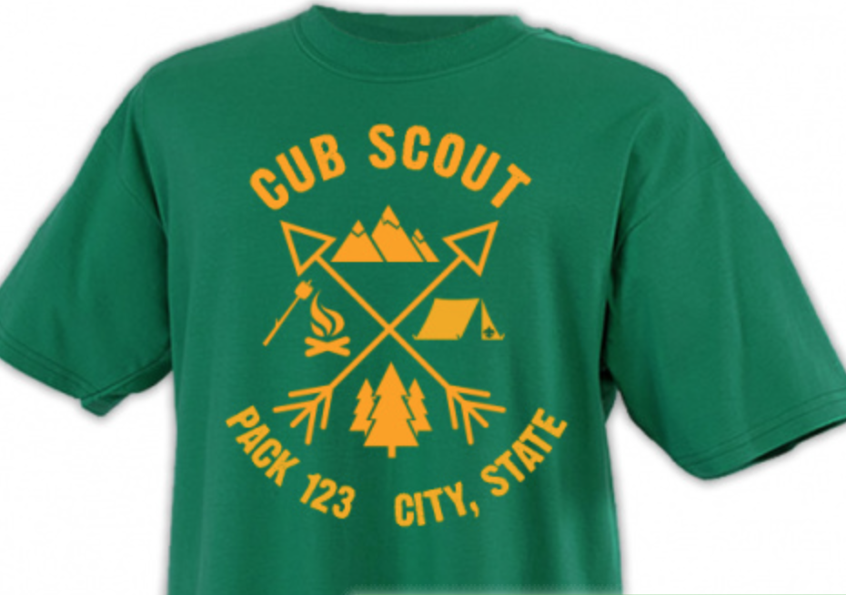

## Pack Announcements ##

### Meetings ###
2018-11-07 will be a regular Den Meeting. All Dens, including Lions, will be meeting.

### Tee-Shirts ###
We have a new design and new color for our Pack 306 t-shirts this year. Each Scout will receive one green, short-sleved tee as part of their registration fees. Additional shits may be ordered for scouts or families; the short sleeve version is $9 and the 3/4 sleeved Raglan style is $14. Please let your Den Leader know your preferred size and any additional shirt orders. The full order will be placed at the end of the week, so please get your requests in no later than Wednesday night.

### Popcorn Sales ###
Popcorn Sales were outstanding this year!!! Tracy will be collecting prize selections from those who sold $150 or more. Order Pick up will be in the Scout Rooms at the church on the November Pack Meeting, the 26th.

### Cub Adventure Day ###
Baltimore Area Council's Cub Adventure Day is on 2018-11-17. Come join us for a day of fun with Archery and Rockets. We believe that the Council will be suppling rockets for all newly registered scouts. Registration is $10 per youth. For information, please see:

[http://www.baltimorebsa.org/event/2018-baltimore-county-cub-adventure-day/2427876](http://www.baltimorebsa.org/event/2018-baltimore-county-cub-adventure-day/2427876)

### Upcoming schedule ###
We have officially entered the Holiday Season, which means our schedule will continue to be more varied than normal. Please note there will only be two regular Den meeting each in November and December and we have a number of other activities planned. We will keep you posted on details via email and the website. 

November Dates:

* 7th - regular Den Meeting
* 14th - regular Den Meeting
* 17th - Cub Adventure Day (see below)
* 21st - Lazer Tag
* 24th - Service Project - rake leaves @ Catonsville Presbyterian 9:30 - 11:30
* 28th - Pack Meeting 

December Dates:

* 5th - regular Den Meeting (this is during Hanukkah, all Dens should work on NON-required activities)
* 12th - regular Den Meeting
* 19th - Pack meeting (we are trying to organize something off-sight as the Church will be having a special event)
* 26th - no meeting

## Past Anouncments ##
* https://cub306.org/announcements/

