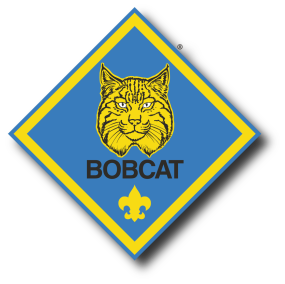

# Bobcat Rank #

 

Bobcat is not a den as such, but the first rank for all Cub Scouts and is required before being fully accepted as a cub scout.

Here is a short message for all our new Scouts:

>For each of you who are new to Pack 306 and also new to one of our dens, We wanted to take a moment to welcome you again. We have a lot of exciting activities planned for this year.
>
>Additionally, you may have heard the leaders talk about the Bobcat rank. This is the first rank that a Cub Scout gets and is a necessary prerequisite to earning the adventures and other awards. Once a Scout has earned his/her Bobcat rank there's a special ceremony to officially join their den.
>
>Due to the limited time that we have with the scouts, we leave it to the parents to make sure their scout meets the Bobcat requirements.
>
>The requirements are found in the first few pages of your handbook. In essence, they are learning the fundamental tenets of Cub Scouts, including learning and understanding the Scout Oath, Scout Law, the Scout handshake, and the Scout motto. All of this information is readily available in the handbook. However, if anyone needs assistance in completing these requirements, please let us know, and we can provide you some guidance.
>
>To the extent that your Scout earns loops/adventures before he meets his/her Bobcat requirements, do not worry, he will receive all of the adventures he earns as soon as he earns Bobcat.
>
>The Bobcat rank is the important first step in a Scout's career and is necessary for advancement. There will be an all-ages Bobcat Ceremony at the October Pack meeting, so please complete the requirements and let the leaders know by before the preceding Den Meeting.
>
>As always please feel free to email any leader with questions.

## For more information ##

* [https://meritbadge.org/wiki/index.php/Bobcat](https://meritbadge.org/wiki/index.php/bobcat)
* [Bobcat Ceremony](http://www.scoutorama.com/ceremony/ceremony_display.cfm?cer_id=10)