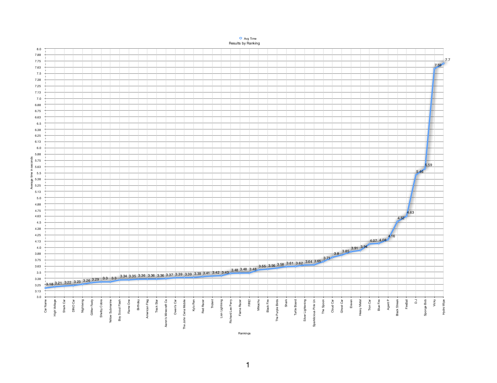
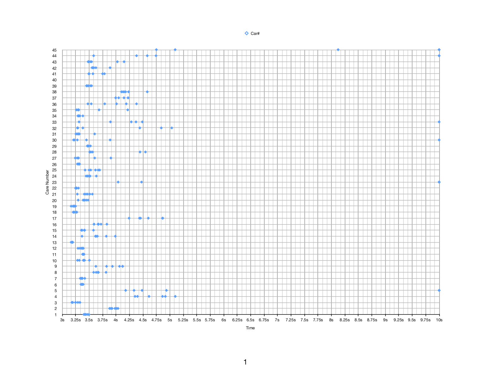
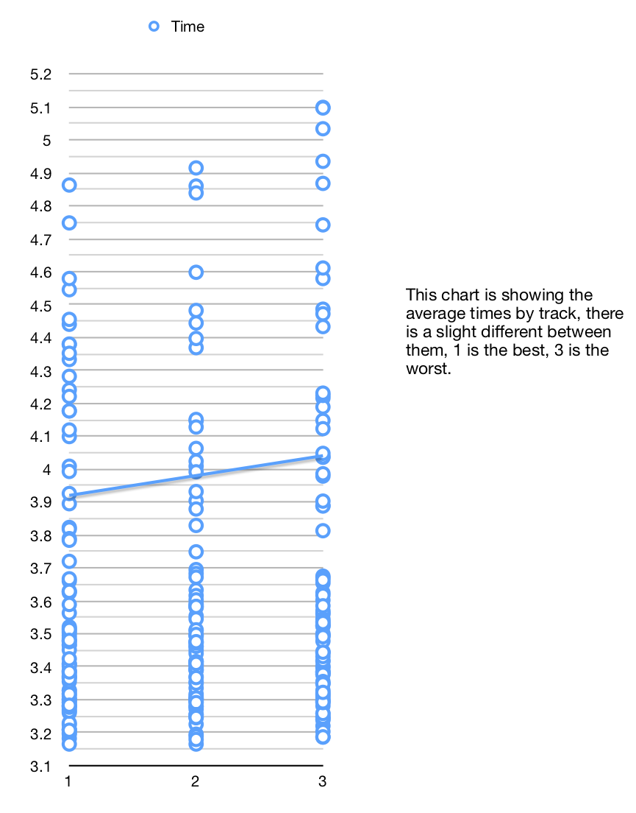

# Pine Wood Derby Rules #

[toc](toc)

## Categories

| Category | Scout | Car Num. | Car |
| -------- | ----- | -------- | --- |
| Cub Scout Theme | S. Isaac    | 21 | Lion Lightning
| Futuristic      | G. Dorian   | 36 | Ghost Car
| Not a Car       | S. Rhys     | 34 | Yellow Submarine
| Scariest        | Z. Benjamin | 19 | Shark Car
| Scout's Choice  | F. Edan     |  6 | Track Star
| Leader's Choice | W. Jonah    | 37 | Agent P

## Speed Results

| Rank | AVG Time | AVG MPH | Scout | Car Num. | Car |
| ---- | -------- | ------- | ----- | -------- | --- |
| 1 | 3.1818 | 7.50 | M. Sam      | 13 | High Voltage |
| 2 | 3.2072 | 7.44 | Z. Benjamin | 19 | Shark Car |
| 3 | 3.2218 | 7.41 | Z. Oliver   | 18 | DINO Car |
| 4 | 3.2316 | 7.38 | S. Kellen   |  3 | Nightwing |

* [Full list](FinalStandings.csv) as a [CSV file](https://en.wikipedia.org/wiki/Comma-separated_values)
* [Full list](FinalStandings.pdf) as a PDF.

The PDF contains a chart of rankings vs time:

## Full Race Results

For full race results you can download these files:

* [Raw data](RaceResults.csv) as a CSV
* [Data](RaceResults.pdf) as a PDF plus some charts

In the PDF is a chart like the one below. The chart shows how your scouts car did for each of its runs. Each row is one scout and is listed by car number. A night grouping means the care preformed pretty much the same regardless of run, a wider gap shows more erratic results.

## Track
Plotting all the results by track shows a slight advantage to track 1 and a disadvantage on 3. This could just be either the track or the ground not being perfect. Overall we are looking at about a 0.2 sec difference.

