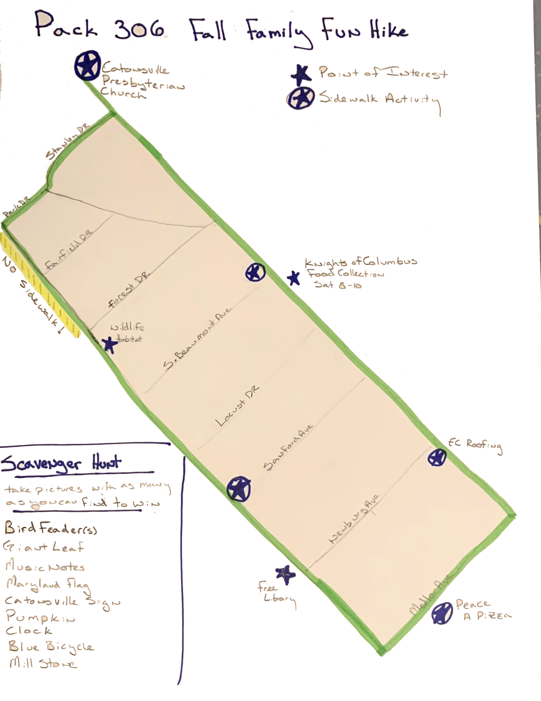
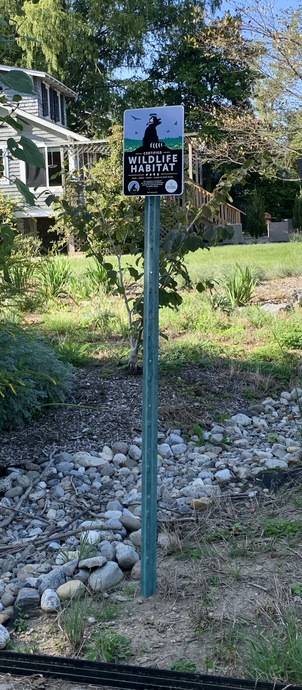
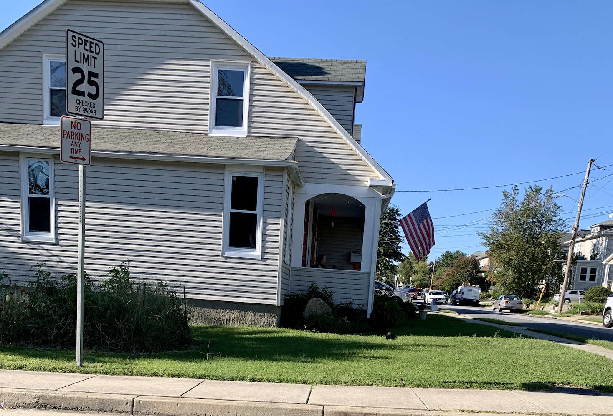
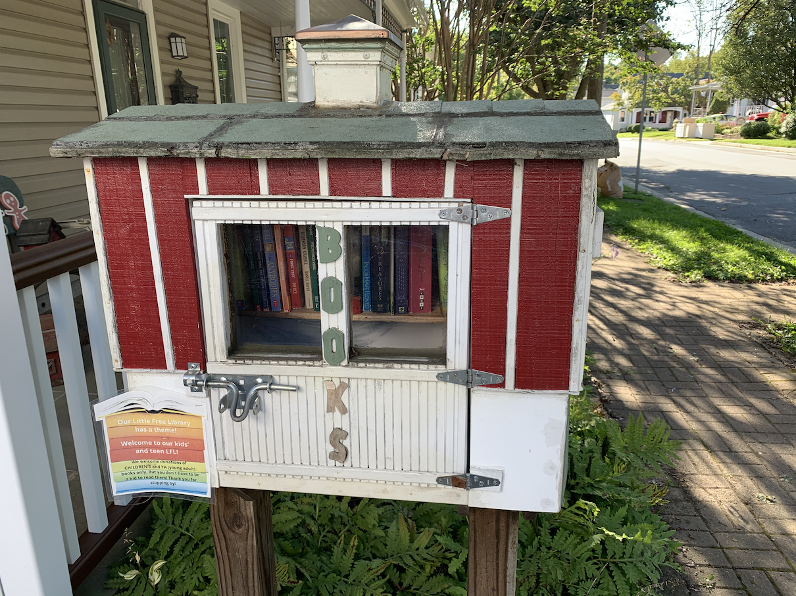

## Catonsville Hike

On September 26th and 27th join us on a socially distant hike through Catonsville. On either or both of these two days walk our path and interact with the pack by taking selfies to post on our Pack Facebook page and leaving chalk messages for other scouts to read. There is no official start or end to the path, so everyone can enter and leave the path when they see fit. There is also no set time, so hopefully we will all randomly be apart and safe while still participating in a shared event.

The entire circuit is 1.37 miles while just the path from the church to Peace A Pizza is 0.67 a miles. The section through the neighborhood is about 0.7 miles.

* full size [map](map.png)

 

## Things to do

### Selfie contest

Take selfies of you and different bird feeders, the one who posts the most to Facebook [group](https://www.facebook.com/groups/1638534726165407/) or [page](https://www.facebook.com/Catonsville-Cub-Scout-Pack-306-2383040078383867) will win a ribbon. All ties will be considered winners.

### Chalk Messages
We have permission to leave chalk messages for other scouts on the sidewalk at the locations listed below. Keep it simple, you'll need to bring your own chalk.

* Peace A Pizza
* EC Roofing
* Catonsville Presbyterian Church (corner of Beechwood and Frederick only)
* The "Mill Stone House" (find it first)
* Pack 306 Sign in front Eric Silva's house (across from the library)

### Leave a canned good
If your out and about on Saturday between 8-10, you can leave a canned good at the "Knights of Columbus".

### Bring a book
If you find the free library box, swap a book out.

### Scavenger Hunt
Find items on the Scavenger Hunt

* Bird Feeders (contest)
* House with Giant Leafs
* Musical Notes
* Maryland Flag
* Catonsville Sign (take selfie and post)
* A Pumpkin
* Clock on a poll
* Blue Bicycle
* Mill Stone in front of house
* Wildlife habitat
* Free Book Library
* Name three different trees
* Find three different kinds of animals

 

