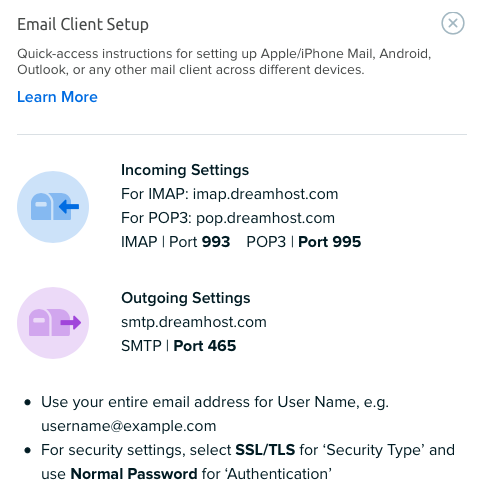

<!-- Title: Leadership -->

[toc](toc)

## Reimbursement ##

For reimbursement please fill out the [Reimbursement form](https://airtable.com/shr2GIK4ZIKfK0iaE) and email [treasurer@cub306.org](mailto:treasurer@cub306.org?subject=Reimbursement).

## E-Mail ##
The Pack News is run by an [Electronic mailing list](https://en.wikipedia.org/wiki/Electronic_mailing_list) run by software called [Mailman](http://www.list.org). We do not currently have an expert on running this kind of email system.

| Mailing List Name | Manage | Brodcast Address | Self Service Page |
| ----------------- | ------ | ---------------- | ------------ |
| Pack Email list       | [Manage](http://lists.cub306.org/admin.cgi/talk-cub306.org/) | talk@cub306.org | [Self Service Join/Leave Page](http://lists.cub306.org/listinfo.cgi/talk-cub306.org) |
| Leadership Email list | [Manage](http://lists.cub306.org/admin.cgi/leadership-cub306.org/) | leadership@lists.cub306.org | [Self Service Join/Leave Page](http://lists.cub306.org/listinfo.cgi/leadership-cub306.org) |

### Leader Emails ###
We also offer [IMAP](https://en.wikipedia.org/wiki/Internet_Message_Access_Protocol) Email address for leaders.

### Setting up email ###

We use Dreamhost for our email and web hosting. They allow us to have unlimited IMAP email accounts.
Below are some setup instructions.

* [General Setup](https://help.dreamhost.com/hc/en-us/articles/214918038-Email-client-configuration-overview)
* [Certificate Help](https://help.dreamhost.com/hc/en-us/articles/215306748-Certificate-domain-mismatch-error-when-connecting-to-a-DreamHost-mail-server)

 

## Contact info ##

* The [Web Mail](https://webmail.cub306.org) interface

Format for addresses:

* den#@cub306.org - dens stay with scouts for their entire time with the pack and then are recycled.
* den_name-leaders@cubh306.org - alias to all leaders in that den

| Position             | Name             | Personal Email             | Pack Email                 | Note |
| -------------------- | ---------------- | -------------------------- | -------------------------- | ---- |
| **Lions**            |                  |                            | lion-leaders@cub306.org    | Group
| Cordinator          | Thomas Cherry    | thomas.cherry@gmail.com    | lion@cub306.org            | 
| &nbsp;
| **Tiger**            |                  |                            | tiger-leaders@cub306.org   | Group
| Den Leader           | *open*           | *open*                     | den5@cub306.org ???        | Open
| Den Leader (g)
| &nbsp;
| **Wolf**             |                  |                            | wolf-leaders@cub306.org    | Group
| Den Leader (b)       | *open*           | *open*                     | den1@cub306.org            | Open
| Den Leader (g)
| &nbsp;
| **Bear**             |                  |                            | bear-leaders@cub306.org    | Group
| Den Leader (b)       | *open*           |                            | den2@cub306.org
| Den Leader (**g**)   | *open*           |                            | den6@cub306.org
| &nbsp;
| **Webelos**          |                  |                            | webelos-leaders@cub306.org | Group
| Den Leader (b)       | Greg Emrick      | emrickg@gmail.com          | den3@cub306.org
| Asst Den Leader (b)  | Eric Fielding    | drericfielding@gmail.com   | eric.fielding@cub306.org   | Pending
| Asst Den Leader (b)  | *open*           |                            |                            | open
| &nbsp;   
| **Arrow Of Light**   |                  |                            | aol-leaders@cub306.org     | Group
| Den Leader (b)       | Wil Heslop       |                            | den4@cub306.org /camping@cub306.org
| Asst Den Leader (b)  | Eric Silva       |                            | 
| &nbsp; 
| **Retired**          |
| Den Leader (b)       | Melissa Cherry   |                            | den5@cub306.org
| Asst. Den Leader (b) | Thomas Cherry    |    | cubmaster@cub306.org
| Asst. Den Leader (b) | Paul Stanley     | stanleyp02@gmail.com       | paul.stanley@cub306.org    | Pending

Den parent emails

| Den     | Used | Send email to here            | Give To Parents                                         |
| ------- | ---- | ----------------------------- | ------------------------------------------------------------------ |
| Lions   |      | lions@lists.cub306.org        | [Self Service Join/Leave Page](http://lists.cub306.org/listinfo.cgi/lions-cub306.org)   |
| Tigers  |      | tigers@lists.cub306.org       | [Self Service Join/Leave Page](http://lists.cub306.org/listinfo.cgi/tigers-cub306.org)  |
| Wolfs   |      | wolfs@lists.cub306.org        | [Self Service Join/Leave Page](http://lists.cub306.org/listinfo.cgi/wolfs-cub306.org)   |
| Bears   |      | bears@lists.cub306.org        | [Self Service Join/Leave Page](http://lists.cub306.org/listinfo.cgi/bears-cub306.org)   |
| Webelos |      | webelos@lists.cub306.org      | [Self Service Join/Leave Page](http://lists.cub306.org/listinfo.cgi/webelos-cub306.org) |
| AoL     |      | arrowoflight@lists.cub306.org | [Self Service Join/Leave Page](http://lists.cub306.org/listinfo.cgi/wolfs-cub306.org)   |

## Lion Mailing Lists, Admin pages
* http://lists.cub306.org/admin.cgi/lions-cub306.org
* http://lists.cub306.org/admin.cgi/lions-cub306.org/members/add
* http://lists.cub306.org/admin.cgi/lions-cub306.org/members/list

## Tiger Mailing Lists, Admin pages
* http://lists.cub306.org/admin.cgi/tigers-cub306.org
* http://lists.cub306.org/admin.cgi/tigers-cub306.org/members/add
* http://lists.cub306.org/admin.cgi/tigers-cub306.org/members/list

## Wolf Mailing Lists, Admin pages
* http://lists.cub306.org/admin.cgi/wolfs-cub306.org
* http://lists.cub306.org/admin.cgi/wolfs-cub306.org/members/add
* http://lists.cub306.org/admin.cgi/wolfs-cub306.org/members/list

## Bear Mailing Lists, Admin pages
* http://lists.cub306.org/admin.cgi/bears-cub306.org
* http://lists.cub306.org/admin.cgi/bears-cub306.org/members/add
* http://lists.cub306.org/admin.cgi/bears-cub306.org/members/list

## Webelos Mailing Lists, Admin pages
* http://lists.cub306.org/admin.cgi/webelos-cub306.org
* http://lists.cub306.org/admin.cgi/webelos-cub306.org/members/add
* http://lists.cub306.org/admin.cgi/webelos-cub306.org/members/list

## Arrow Of Light Mailing Lists, Admin pages
* http://lists.cub306.org/admin.cgi/arrowoflight-cub306.org
* http://lists.cub306.org/admin.cgi/arrowoflight-cub306.org/members/add
* http://lists.cub306.org/admin.cgi/arrowoflight-cub306.org/members/list

## Dropbox ##

Send an email to thomas.cherry@gmail.com to be added to the dropbox. 

## Tools ##
* [Family Scouting](https://www.scouting.org/familyscouting/)
    * [FAQ](https://i9peu1ikn3a16vg4e45rqi17-wpengine.netdna-ssl.com/wp-content/uploads/2019/02/UPDATED-Family-Scouting-FAQ-2-11-191.pdf)
* [Safe Scouting Chart](http://www.broadcreekbsa.org/document/2013-safe-scouting-chart/125709)
* [Wood Badge Registration](http://www.baltimorebsa.org/programs/wood-badge/n6-220-18-2/67186)
* [Holiday Party Sheet](https://docs.google.com/spreadsheets/d/1r09A5cOu5ShuX7bVW-HlU0yzR9TqAG0v9Jep3ALC9_s/edit?usp=sharing)
* [operation manual](operationmanual)

## Books and Documents ##

* Requirement Addendum - Used to update the older handbooks
    1. [Tiger Addendum](https://filestore.scouting.org/filestore/cubscouts/pdf/Tiger_Addendum.pdf)
    1. [Wolf Addendum](https://filestore.scouting.org/filestore/cubscouts/pdf/Wolf_Addendum.pdf)
    1. [Bear Addendum](https://filestore.scouting.org/filestore/cubscouts/pdf/Bear_Addendum.pdf)
    1. [Webelos Addendum](https://filestore.scouting.org/filestore/cubscouts/pdf/WEBELOS_AOL_Addendum.pdf)
* [Summer Passport](http://www.baltimorebsa.org/cubpassport)

## Youth Protection Training ##

All adult leaders must take this:

1. [Youth Protection Training](https://www.scouting.org/training/youth-protection/ "Youth Protection Training")
* If you need help, try [How to take YPT](/ypt)

