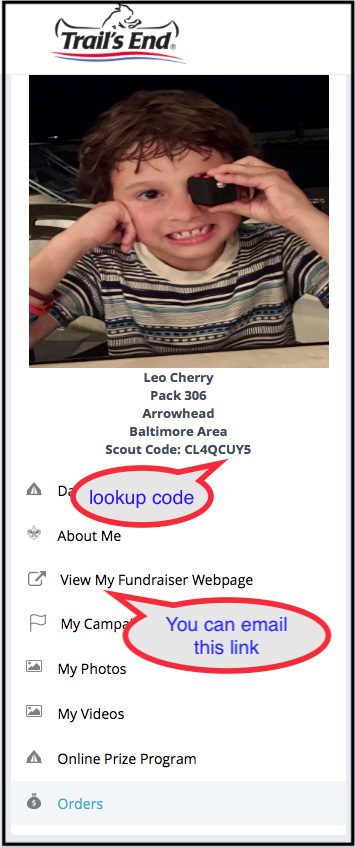

## Popcorn Season ##

Popcorn season is upon us. Here we will place links to help parents and scouts get through this effort.

## Online Sales ##
If you would like to sign up for online sales then goto:

* [https://www.trails-end.com/registration/parent](https://www.trails-end.com/registration/parent)

and use the following details when asked for our "Unit Selection" (forth page in):

* Council: `Baltimore Area`
* District: `Arrowhead`
* Unit: `Pack 306`

When done setting up the account, you will then get a "Scout Code" from the left navigation (see example image). This code can be emailed by you to your friends and family to be looked up on the "Find A Scout" [page](https://www.trails-end.com/sellers/support/code). The account page will also give you a direct link ("View My Fundraiser Webpage") that you can email as well. Both of these will take people to a sales site specificly for your scout.

To personalize the sales site you can upload an image and provide a short bio or other information. These settings can be made in the "About Me" link.

## Our Scouts Popcorn Links ##

* [Asher S. - J9C27ERV](https://www.trails-end.com/scout/J9C27ERV)
* [Leif S. - 2XCRUHVW](https://www.trails-end.com/scout/2XCRUHVW)
* [Leo C. - CL4QCUY5](https://www.trails-end.com/scout/CL4QCUY5)

(email the [cubmaster](mailto:cubmaster@pack306.org?subject=Add%20Popcorn%20Link) if you want your scout added to this list.

 

