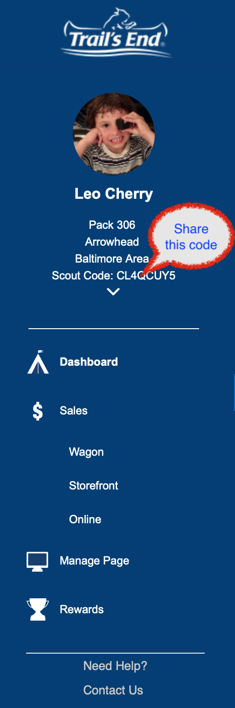

## Popcorn Fundraiser 2019 ##

Popcorn Sales Begin in August! Please take a moment to follow the steps below and prepare for a fun, easy season.

New technology will make this year's popcorn fundraising easier and more *fun*.

### 1) Register ###
All scouts must register for an online account through Trail's End - even if you only intend to do "paper" sales. I cannot create an account for your scout this year like I did last year.

If you did not register for an account last year, please go here: [https://www.trails-end.com/registration](https://www.trails-end.com/registration) Choose "Parent, On Behalf of my Scout" and go through the steps to create an account. We are Baltimore Area Council, Arrowhead District, Pack 306.

If you did register for an account last year - you are good to go. No need to create a new one - but you can log in and update your website if you like.

### 2) Download ###
Download the Trails-End App to your Smartphone. Search your app store for "Trails-End". This is the point of sales that your scout will use to sell popcorn and sign up for "storefront shifts".

### 3) Sign-Up ###
Log in using your scout's online log-in information. Now choose the "Storefront" icon at the bottom of the screen. Next choose the "upcoming" at the bottom right of the map. These are all the show and sells that we have already booked!  

Please consider signing up for a shift. Show and sells are easy and fun ways for your scout to sell while having fun in the community. We have been invited to the Music on the Hill festival on Edmondson Avenue on August 25th - there's even a petting zoo there! And Park Ridge Creamery in Ellicott City wants us to make our sales table into a fun afternoon event with kid friendly activities. 

Scouts will receive one entry into a big item prize draw (ie. a tent) for every show and sell shift in which they participate!

*Please note you are signing your scout up for a shift. We must have at least two adults at the table for each shift - if you as an adult are willing to "man" the table with your scout - please let me know! 

### 4) Start Selling ###
Popcorn product will arrive in early August. If your scout wants some product to sell directly - let me know and we'll arrange a pick up. No more having to wait until late November for your customer to get their popcorn! This should make sales so much easier for the kids!

For more information on Popcorn please email [Tracy Soltesz](mailto:events@cub306.org?subject=Popcorn+questions).
 

