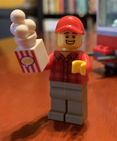

## Popcorn Fundraiser 2019 ##

Popcorn Fundraising Sales are Live and continue through Dec. 31, 2020! Please take a moment to follow the steps below and join our fun, easy Pack fundraising campaign. 

72% of every purchase comes back to Pack 306 and Baltimore Area Council!

To keep our scouts and supporters safe, all popcorn sales will be digital this year, with product shipped directly to your supporter.

## Step 1 - Register

All scouts must register for an online account through Trail's End. 

If you did not register for an account last year, please go here: https://www.trails-end.com/registration Choose "Parent, On Behalf of my Scout" and go through the steps to create an account. We are Baltimore Area Council, Arrowhead District, Pack 306.

If you did register for an account last year - you are good to go. No need to create a new one, but you will be asked to update your password the first time you log in this year. 

## Step 2 - Website Sales

Once you have registered, create or update your personalized website. You can add photos, short videos, and an "About Me" paragraph to tell your supporters about your scouting adventures.

You can also set your sales goal and choose a "favorite" product to recommend to your supporters.

Once your website is complete, send your personal sales link out via email or social media.

Be sure to tell your supporters that Baltimore Area Council is picking up the shipping tab for all purchases of `$30` or more!

## Step 3 - Online Direct through the Trails End App

Download the Trails End App to your Smartphone. Search your app store for "Trails End". This is the point of sales that you will use to take popcorn orders through socially distant, face-to-face interactions.

Maybe your parent has returned to their workplace where some of your past supporters also work. Maybe your neighbor likes to support your scouting journey but you don't have his email address. You see him outside mowing the lawn this weekend, so you give him and wave, put your mask on and head on over to see if he'd like to support Pack 306 again this year.

To make sales through the app, choose the "Online Direct" button at the bottom of your app screen. Then choose "Start Sale" button. 

It's easy - just follow the prompts to choose the product, enter your supporter's shipping information, and take a credit card payment. Enter the credit card manually or if you have a Square plug in reader, you can swipe the card through that.

Viola! The product will be shipped directly to your supporter's home. No need to drop off product at a future time!

And remember, all Online Direct Sales of $30 or more enjoy free shipping thanks to Baltimore Area Council.

## Step 4 - Rewards and Prizes

Prizes this year will also be digital! For each prize level you reach, you will receive an Amazon Gift Card of increasing value so that you and your parents can select your own prize through Amazon!

The first prize category starts at 400 points. All sales through the website and the Online Direct app score you 2 points for every dollar your supporter spends.

But wait, that's not all. There are additional Council specific rewards too!

Popcorn Patch: Every Pack 306 scout that makes at least one popcorn sale will receive the 2020 Popcorn Patch.

Additional BAC specific rewards include Scout Shop gift cards, Dave & Buster Experience, and Free Scout Camp. Stay tuned for more details!

* [Price Flyer](popcorn_2020_prize_flyer.pdf)

## Questions

Have a question or need some help? For more information on Popcorn please email our "Kernel Master" [Tracy Soltesz](mailto:popcorn@cub306.org?subject=Popcorn+questions).
 

<!--
----

* QR code to Prizes
	* 
* QR code to Trails End Web Site
	* 

-->