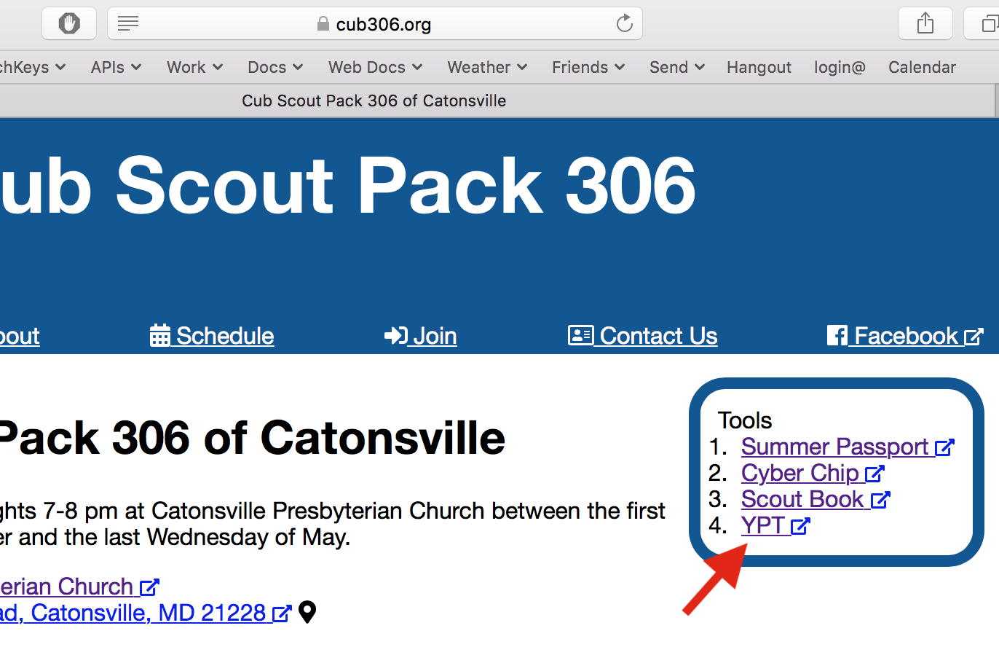
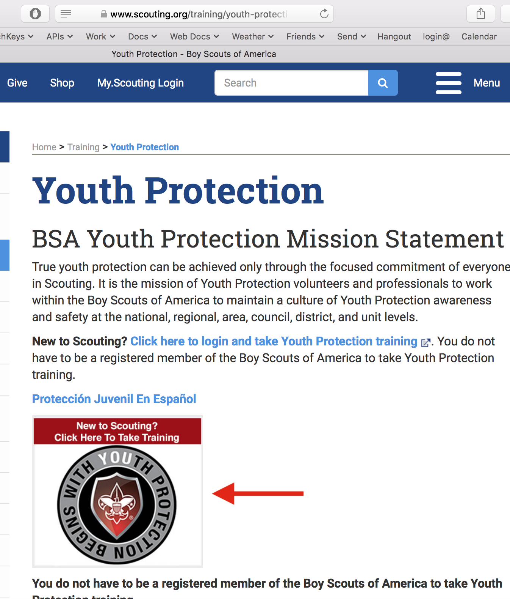
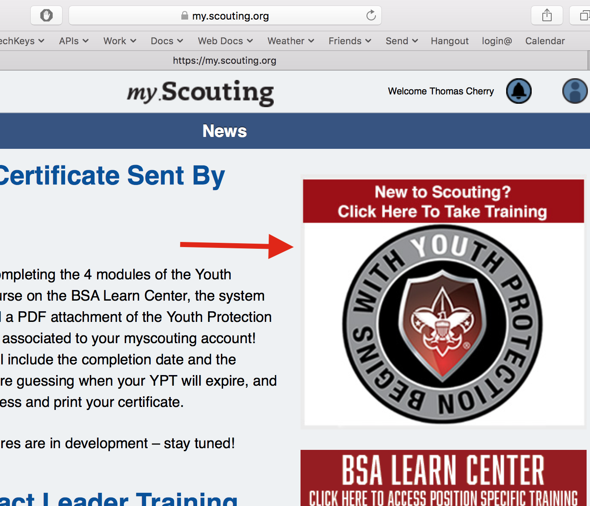
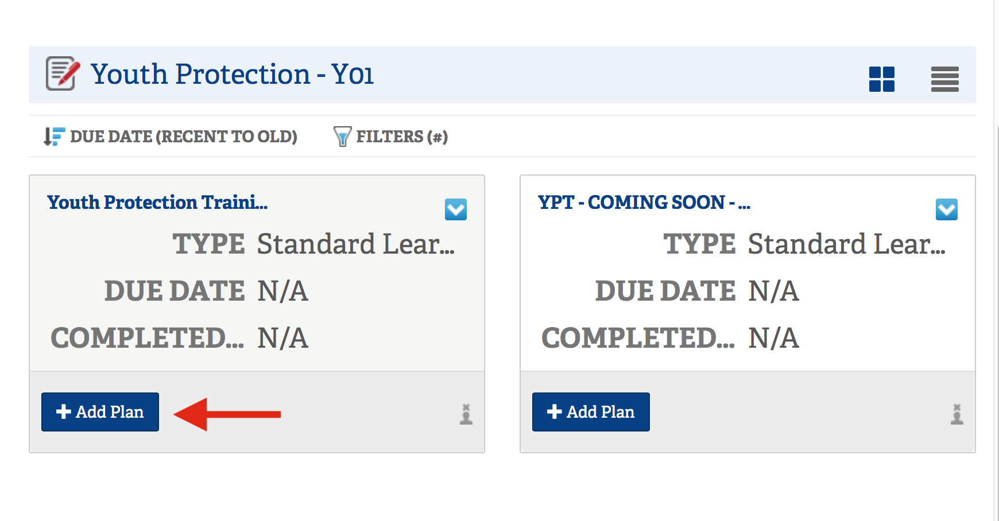
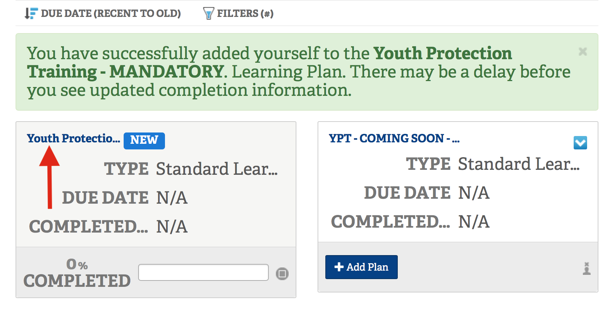
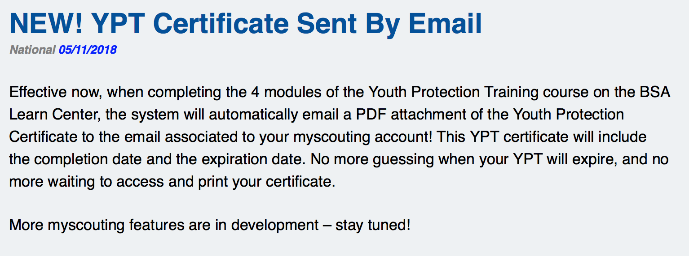
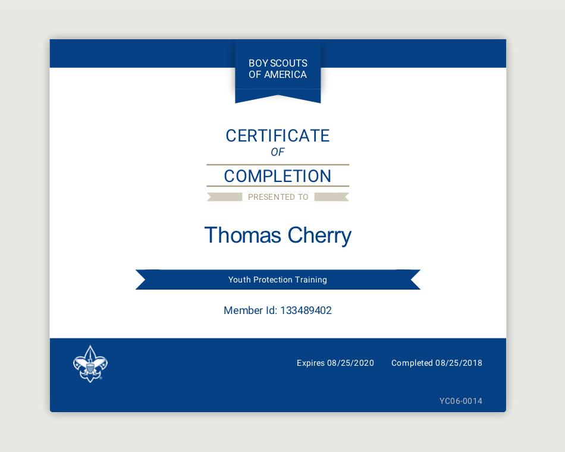

# Taking Youth Protection Training #

## Need Help ##
First, if you have any help or are having trouble, please contact the [Cub Master](mailto:cubmaster@cub306.org?subject=Help%20with%20Youth%20Protection%20Training) or anyone on the [contact](../contact.md) page.

## Start ##
You can start by clicking on the "YPT" link on the Pack 306 Site Tool Box or go directly to [https://www.scouting.org/training/youth-protection/](https://www.scouting.org/training/youth-protection/)

 
## Logging in ##
On the [scouting.org](https://www.scouting.org/) site, click the "click here to take training" button/image. You will be asked to login or create an account if you don't already have an account.

 
## View Training ##
After logging in you will need to again click on the "click here to take training" button/image.

 
## Adding Course ##
Once you login, add the Youth Protection Training - MANDITORY" course to your plan.

 
## Start Course ##
Start the course by clicking on the blue course title text.

 
## Pass Test ##
Even if your told you need to go print your Certificate, you don't, there is a notice on https://my.scouting.org stating that your Certificate will be emailed to you.

 
## Done ##
Check your email, and your spam folder, you should get an email with in minutes. Look for the title "Your YPT Certificate" from `membership@scouting.org`.

 

 
## Need Help ##
If you have any trouble, please contact the [Cub Master](mailto:cubmaster@cub306.org?subject=Help%20with%20Youth%20Protection%20Training) or anyone on the [contact](../contact.md) page.
 
